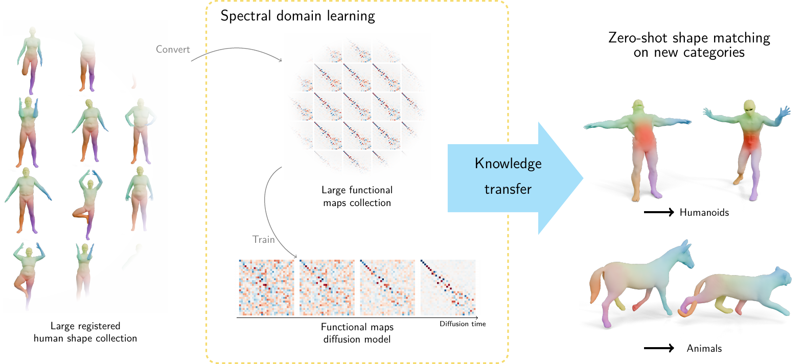

<div align="center">

# DiffuMatch: Category-Agnostic Spectral Diffusion Priors for Robust Non-rigid Shape Matching


[](https://arxiv.org/pdf/2507.23715)
[](https://daidedou.github.io/publication/nonrigiddiff)

<font size="3">
<a href="https://daidedou.github.io" style="font-size:100%;">Emery Pierson<sup>1</sup></a>&emsp;
<a href="https://craigleili.github.io/" style="font-size:100%;">Lei Li<sup>2</sup></a>&emsp;<br>
<a href="https://www.3dunderstanding.org/team.html" style="font-size:100%;">Angela Dai<sup>2</sup></a>&emsp;
<a href="https://www.lix.polytechnique.fr/~maks/" style="font-size:100%;">Maks Ovsjanikov<sup>1</sup></a>&emsp;
</font>
<br>

<font size="3">
<sup>1</sup>Ecole polytechnique, France<br>
<sup>2</sup>Technical University of Munich, Deutschland<br>
</font>





Code release of the DiffuMatch paper, presented at **ICCV 2025**. A diffusion-based, zero-shot approach for non-rigid shape matching!

</div>

## 🛠️ Installation  

```bash
# Clone the repository
git clone https://github.com/daidedou/diffumatch.git
```
Then install python>=3.9, pytorch>=2.5 with the method of your choice. I prefer conda (You can try with older version, it should work, as I did not use anything fancy. My guess is at least 1.8)
```bash
conda create -n diffumatch python=3.9
```
Run the [command](https://pytorch.org/get-started/previous-versions/) to install pytorch according to your version. For me it was:
```bash
conda activate diffumatch
conda install pytorch==2.5.0 torchvision==0.20.0 torchaudio==2.5.0 pytorch-cuda=12.4 -c pytorch -c nvidia
```
Then install the necessary packages
```bash
pip install -r requirements.txt
```

Note: To be fast enough, our Zoomout implementation relies on [Pykeops](https://www.kernel-operations.io/keops/python/installation.html). Installation might fail from time to time (although it is much better since they switched to nvrtc). If you have problems with Pykeops, their github [issues](https://github.com/getkeops/keops/issues) often have a solution for you!

---

## Training the functional maps diffusion model

Download the Dynamic FAUST dataset [here](https://dfaust.is.tue.mpg.de/). Then, run

```bash
python preprocess_fmap_dataset.py --path dfaust_path
```
After that, run
```bash
python train_fmap.py
```
If you want to train a diffusion model on a different dataset, it should be possible if you save your shapes in a single folder and run the preprocess script with a different path and dataset argument. After that create a config file in config/diffuosion/custom_conf.yaml according to the dfaust_fmap template. The training is then:
```bash
python train_fmap.py --config custom_conf
```
The whole training relies of the [EDM repository](https://github.com/NVlabs/edm). Sorry if it is not compatible with your workflow.

## Zero-shot shape matching

### Matching two shapes

If you want to try the model, I suggest you to run the [notebook](diffumatch_demo.ipynb), or alternatively the gradio demo script (may not be bug free). 
```bash
python gradio_demo.py --config config/matching/sds.yaml
```
If you want to test your own trained diffusion model, modify the config lines:
```yaml
diff_model:
  train_dir: pretrained
```
to
```yaml
diff_model:
  train_dir: fmap_exps
  diff_num_exp: num_exp
```
where num_exp is the number of your experiences in the fmap_exps folder (can be custom too).

### Shape Non-rigid Kinematics (SNK) 

We also provide a (non-official) reproduction of [Shape Non-rigid Kinematics (SNK)](https://arxiv.org/abs/2403.06804), and you can try it in snk_demo.ipynb or use snk.yaml config

### Paper experiments

Read [experiments.md](experiments.md)

## 📜 License  
This project is licensed under the [Apache Licence](LICENSE).  

---

## Acknowledgements  
Thanks to amazing deep functional functional maps repositories that were very useful for us (non-exhaustive):
- [AttentiveFMaps](https://github.com/craigleili/AttentiveFMaps)  
- [Robust shape matching](https://github.com/dongliangcao/Unsupervised-Learning-of-Robust-Spectral-Shape-Matching)  
- [SimplifiedFmaps](https://github.com/RobinMagnet/SimplifiedFmapsLearning)

And also
- [Pyfmaps](https://robinmagnet.github.io/pyFM/)
- [Potpourri3d](https://github.com/nmwsharp/potpourri3d) 
- [EDM](https://github.com/NVlabs/edm)

## Citation

If you found our work useful, please cite 
```bibtex
@article{pierson2025diffumatch,
  title={DiffuMatch: Category-Agnostic Spectral Diffusion Priors for Robust Non-rigid Shape Matching},
  author={Pierson, Emery and Li, Lei and Dai, Angela and Ovsjanikov, Maks},
  journal={arXiv preprint arXiv:2507.23715},
  year={2025}
}
```